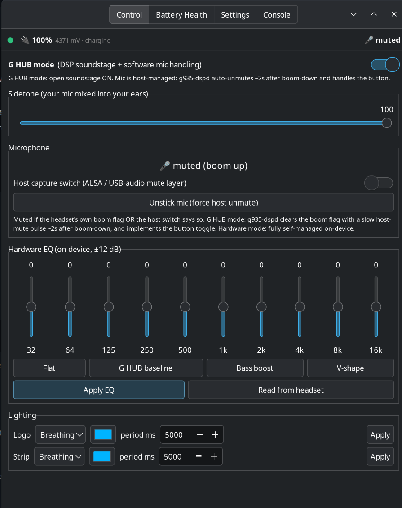
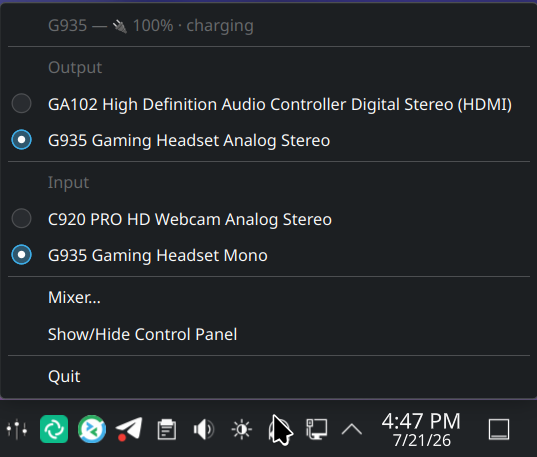
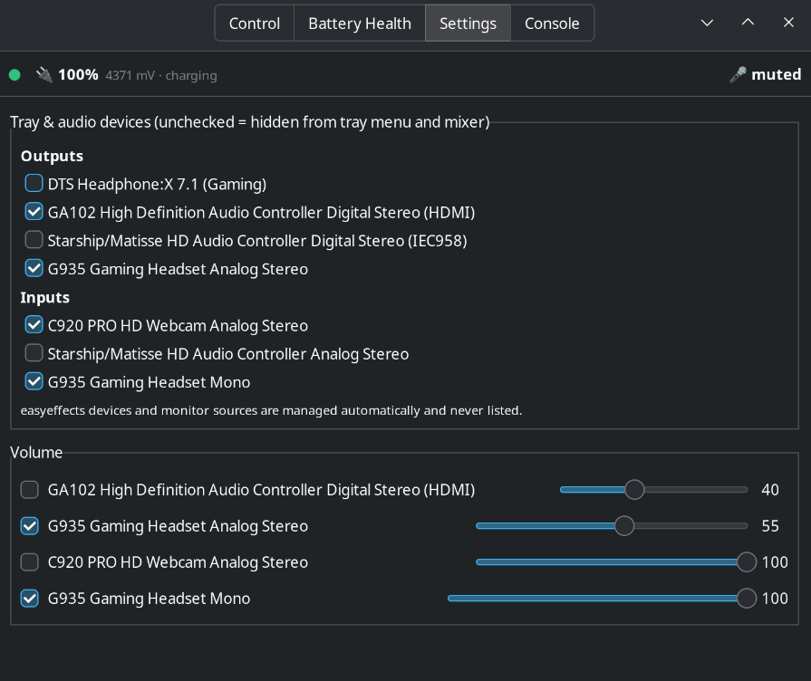

# g935-linux — Logitech G935 control for Linux, no G HUB required

Full control of the Logitech G935 wireless headset over raw HID
(`/dev/hidraw*`). Everything G HUB does on-device, done natively on Linux:

- **DSP soundstage ("G HUB sound")** — the wide, out-of-head sound the headset
  only has while G HUB is connected on Windows. It's an on-device DSP state,
  enabled with one HID++ command; a small daemon re-enables it on every
  headset power-on.
- **10-band hardware EQ** (32 Hz – 16 kHz, ±12 dB) — stored on the headset,
  survives reboots, works with any OS afterwards.
- **Sidetone** (0–100), **RGB lighting** (logo + strip zones, persistent),
  **battery level**, and **boom-mic mute handling** (the mic logic G HUB
  normally runs host-side).
- **GTK3 control panel** (`g935-control.py`) with tray icon, EQ presets,
  lighting, sidetone, a raw HID++ console, and audio-device pickers.

## Screenshots

| Control panel | Tray menu |
|---|---|
|  |  |



## ⚠️ Tested on exactly one setup

This has only been tested on:

- **Logitech G935** (wireless receiver, USB PID `0a87`)
- **Kubuntu / Ubuntu 26.04 LTS**, KDE Plasma 6.6 on **Wayland**, PipeWire
- Python 3.14

Anything else — other headsets, other distros, GNOME, X11, PulseAudio — is
uncharted. The code tries to degrade gracefully (features it can't discover are
hidden, unknown devices prompt before probing), but you're in test-pilot
territory. **Issues or success reports: hit me up on X
[@MatthewPhone](https://x.com/MatthewPhone)** or open a GitHub issue.

## Prerequisites

```bash
sudo apt install python3-gi gir1.2-gtk-3.0 gir1.2-ayatanaappindicator3-0.1 \
                 alsa-utils pulseaudio-utils
```

- `python3-gi` + GTK3 — the control panel
- `gir1.2-ayatanaappindicator3-0.1` — tray icon (optional; without it the app
  runs windowed)
- `alsa-utils` (`amixer`) — boom-mic mute handling in G HUB mode
- `pulseaudio-utils` (`pactl`) — audio device pickers/volume (works with
  PipeWire's pulse server too; optional)
- `python3-hid` (or `pip install hid`) — only for the standalone
  `g935-enable.py` replay script; the GUI and daemon don't need it

## Install

```bash
git clone https://github.com/mattmattmatt1/g935-linux.git
cd g935-linux

# 1. Let your user talk to the headset (udev rule, one-time):
sudo cp 99-g935.rules /etc/udev/rules.d/
sudo udevadm control --reload && sudo udevadm trigger
# then unplug/replug the receiver

# 2. Run the control panel:
python3 g935-control.py
```

Optional pieces:

```bash
# Auto re-enable the DSP + mic handling on every headset power-on (daemon):
cp g935-dspd.py ~/.local/bin/
cp g935-dsp.service ~/.config/systemd/user/
systemctl --user daemon-reload
systemctl --user enable --now g935-dsp

# App menu entry (assumes g935-control.py copied to ~/.local/bin, chmod +x):
cp g935-control.py ~/.local/bin/ && chmod +x ~/.local/bin/g935-control.py
cp g935-control.desktop ~/.local/share/applications/

# Keep the desktop's mic-mute key out of the loop in G HUB mode (recommended
# if you use the daemon; stops "press unmute twice" fights):
sudo cp 70-g935-micmute.hwdb /etc/udev/hwdb.d/
sudo systemd-hwdb update && sudo udevadm trigger
```

## The two modes

The headset has a mode switch (`11 ff 05 2b 01/00`) that changes more than sound:

| | **Hardware mode** (stock) | **G HUB mode** |
|---|---|---|
| Sound | flat/narrow | DSP soundstage on |
| Boom mute | handled fully in firmware, just works | host must manage it (the daemon plays G HUB's role) |
| Mic button | works on-device | only emits an event (daemon handles it) |

Pick the mode in the GUI; it's remembered in `~/.config/g935/mode` and
re-asserted by the daemon on every power-on. If you don't run the daemon,
stay in hardware mode — in G HUB mode without it, raising the boom mutes the
mic and nothing will unmute it.

## What's in here

| File | Purpose |
|---|---|
| `g935-control.py` | GTK3 control panel (EQ, lighting, sidetone, modes, console) |
| `g935-dspd.py` + `g935-dsp.service` | power-on watcher + G HUB-mode mic daemon |
| `99-g935.rules` | udev rule granting hidraw access |
| `70-g935-micmute.hwdb` | masks the headset's KEY_MICMUTE so the desktop stays out |
| `g935-enable.py` / `g935-enable-v2.py` | standalone DSP-enable replay scripts |
| `g935-step.py` | interactive sequence bisector (debugging tool) |
| `easyeffects-g935.json` | optional EasyEffects preset (software EQ route) |

## License

[PolyForm Noncommercial 1.0.0](LICENSE) — free to use, modify, and share for
any noncommercial purpose. **Commercial use (including selling this or
products built on it) requires a separate license — contact
[@MatthewPhone](https://x.com/MatthewPhone) on X.**

## Credits / prior art

- [g933-utils](https://github.com/ashkitten/g933-utils) — HID++ groundwork on
  the sibling G933
- [HeadsetControl](https://github.com/Sapd/HeadsetControl) — sidetone/battery
  for many headsets, including this one
