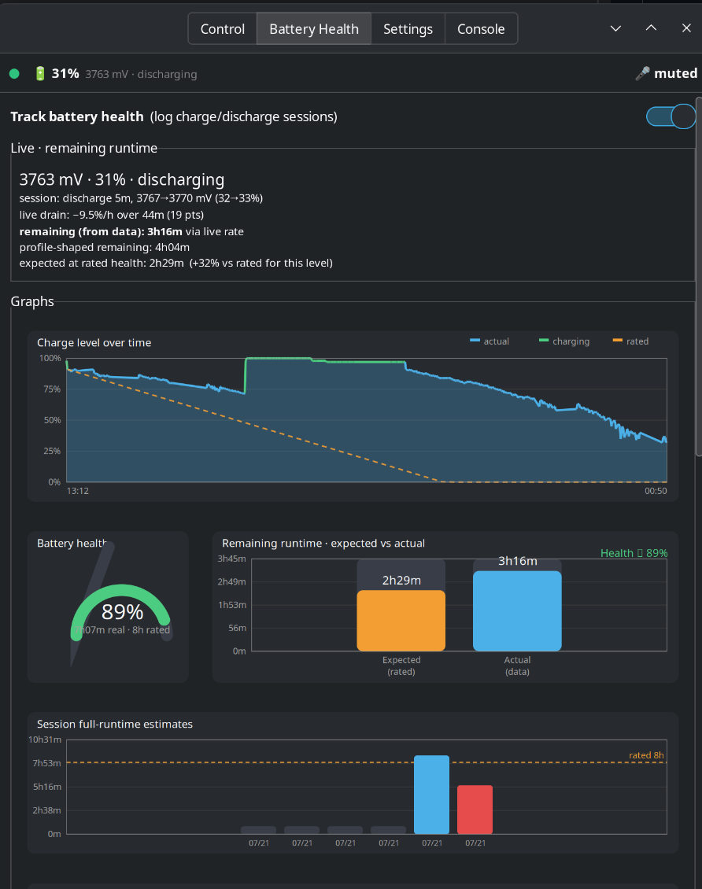

# g935-linux — Logitech G935 control for Linux, no G HUB required

Full control of the Logitech G935 wireless headset over raw HID
(`/dev/hidraw*`). Everything G HUB does on-device, done natively on Linux:

- **DSP soundstage ("G HUB sound")** — the wide, out-of-head sound the headset
  only has while G HUB is connected on Windows. It's an on-device DSP state,
  enabled with one HID++ command; a small daemon re-enables it on every
  headset power-on.
- **10-band hardware EQ** (32 Hz – 16 kHz, ±12 dB) — stored on the headset,
  survives reboots, works with any OS afterwards.
- **Sidetone** (0–100), **RGB lighting** (logo + strip zones, persistent),
  **battery level + health graphs**, and **boom-mic mute handling** (the mic
  logic G HUB normally runs host-side).
- **GTK3 control panel** (`g935-control`) with tray icon, EQ presets,
  lighting, sidetone, battery expect-vs-actual charts, a raw HID++ console,
  and audio-device pickers.

## Screenshots

| Control panel | Tray menu |
|---|---|
|  |  |




## ⚠️ Tested on exactly one setup

This has only been tested on:

- **Logitech G935** (wireless receiver, USB PID `0a87`)
- **Kubuntu / Ubuntu 26.04 LTS**, KDE Plasma 6.6 on **Wayland**, PipeWire
- Python 3.14

Anything else — other headsets, other distros, GNOME, X11, PulseAudio — is
uncharted. The code tries to degrade gracefully (features it can't discover are
hidden, unknown devices prompt before probing), but you're in test-pilot
territory. **Issues or success reports: hit me up on X
[@MatthewPhone](https://x.com/MatthewPhone)** or open a GitHub issue.

## Prerequisites

```bash
sudo apt install python3-gi gir1.2-gtk-3.0 gir1.2-ayatanaappindicator3-0.1 \
                 alsa-utils pulseaudio-utils
```

- `python3-gi` + GTK3 — the control panel
- `gir1.2-ayatanaappindicator3-0.1` — tray icon (optional; without it the app
  runs windowed)
- `alsa-utils` (`amixer`) — boom-mic mute handling in G HUB mode
- `pulseaudio-utils` (`pactl`) — audio device pickers/volume (works with
  PipeWire's pulse server too; optional)
- `python3-hid` (or `pip install hid`) — only for the standalone
  `tools/g935-enable.py` hidapi path; the GUI and daemon don't need it

## Install

```bash
git clone https://github.com/mattmattmatt1/g935-linux.git
cd g935-linux

# 1. Let your user talk to the headset (udev + optional mic-mute hwdb):
./install.sh --udev
# then unplug/replug the receiver

# 2. Install the control panel + daemon for your user:
./install.sh --user
# or: make install-user

# 3. Run the control panel:
g935-control
# from a git checkout without install:
python3 g935-control.py
```

Optional daemon (required for **G HUB mode** mic handling + auto DSP on power-on):

```bash
systemctl --user enable --now g935-dsp
```

## The two modes

The headset has a mode switch (`11 ff 05 2b 01/00`) that changes more than sound.
**Default is hardware mode** (safe without the daemon). Flip the switch in the
GUI for G HUB mode.

| | **Hardware mode** (default) | **G HUB mode** |
|---|---|---|
| Sound | flat/narrow | DSP soundstage on |
| Boom mute | handled fully in firmware, just works | host must manage it (`g935-dspd`) |
| Mic button | works on-device | only emits an event (daemon handles it) |

Mode is stored in `~/.config/g935/mode` and re-asserted by the daemon on every
power-on. **If you use G HUB mode, run the daemon.** Without it, raising the
boom mutes the mic and nothing will unmute it (the panel warns you).

### Who owns what

| Job | Daemon running | Daemon not running |
|---|---|---|
| Power-on DSP enable | **daemon** | control panel |
| Boom mute / button | **daemon** | panel shows state only (Unstick button) |
| EQ / lighting / sidetone | control panel | control panel |
| Mode toggle (user switch) | panel writes mode file + command | same |

## Battery health

The Battery Health tab logs voltage samples while the panel is open and builds:

- **Live remaining runtime** from recent discharge datapoints
- **Expected vs actual** comparison against the rated runtime spec
- **Learned drain profile** (mV/h by voltage bin) and session history graphs

Data lives in `~/.config/g935/health.json`. Health % needs longer off-charger
sessions (merged ≥30 min / ≥8% drop); short sessions still feed live ETA and
the profile. No coulomb counter exists — this is an honest voltage-based
extrapolation, not a BMS.

## Layout

| Path | Purpose |
|---|---|
| `g935-control.py` | GTK3 control panel |
| `g935-dspd.py` + `g935-dsp.service` | power-on watcher + G HUB-mode mic daemon |
| `g935/` | shared library (HID++, mic, mode, battery, charts) |
| `99-g935.rules` | udev rule granting hidraw access |
| `70-g935-micmute.hwdb` | masks KEY_MICMUTE so the desktop stays out of G HUB mode |
| `tools/` | research scripts (enable replay, sequence bisector) |
| `tests/` | offline unit tests (`make test`) |
| `install.sh` / `Makefile` | user + udev install |
| `easyeffects-g935.json` | optional EasyEffects preset (software EQ route) |

## Troubleshooting

| Symptom | Fix |
|---|---|
| Permission denied on hidraw | `./install.sh --udev`, then replug receiver |
| Tray icon missing (GNOME) | install AppIndicator extension, or run windowed |
| Mic stuck muted after boom up | enable daemon: `systemctl --user enable --now g935-dsp`, or switch to hardware mode |
| "press unmute twice" | install `70-g935-micmute.hwdb` via `./install.sh --udev` |
| Sound flat after power cycle | daemon not running, or mode is hardware — enable daemon / flip G HUB mode |
| Panel dead after unplug/replug | should auto-recover; if not, restart the panel (file a bug) |
| `g935-control: command not found` | ensure `~/.local/bin` is on `PATH`, or run `python3 g935-control.py` |

## Development

```bash
make test       # offline unit tests
make compile    # bytecode compile check
```

Research tools (fixed feature indices from 2026-07 captures; GUI discovers live):

```bash
python3 tools/g935-enable-v2.py   # full cold-connect with ACK/ERR
python3 tools/g935-step.py        # interactive sequence bisector
```

## License

[PolyForm Noncommercial 1.0.0](LICENSE) — free to use, modify, and share for
any noncommercial purpose. **Commercial use (including selling this or
products built on it) requires a separate license — contact
[@MatthewPhone](https://x.com/MatthewPhone) on X.**

## Credits / prior art

- [g933-utils](https://github.com/ashkitten/g933-utils) — HID++ groundwork on
  the sibling G933
- [HeadsetControl](https://github.com/Sapd/HeadsetControl) — sidetone/battery
  for many headsets, including this one
