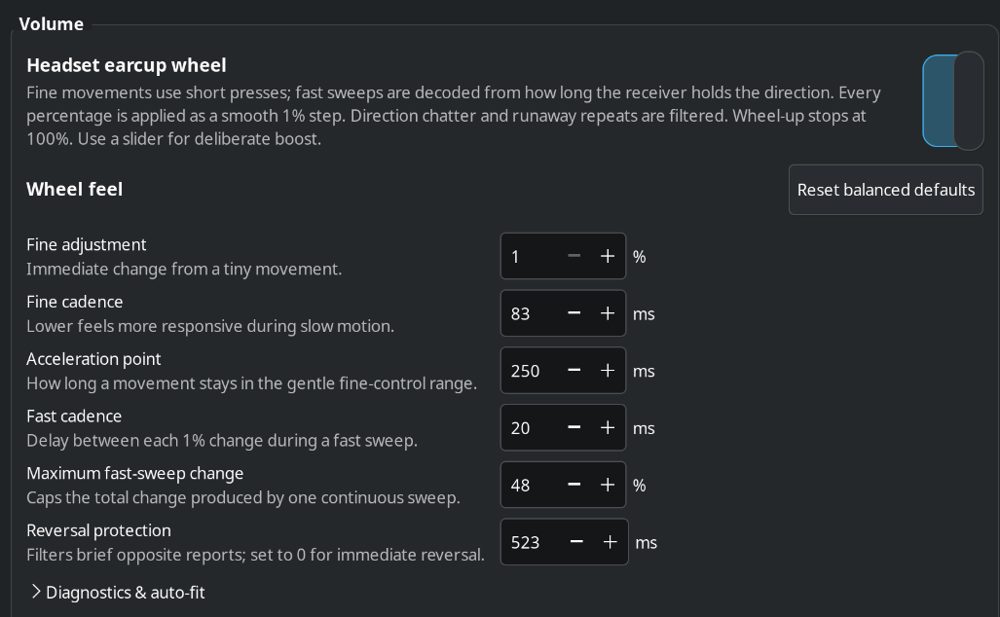
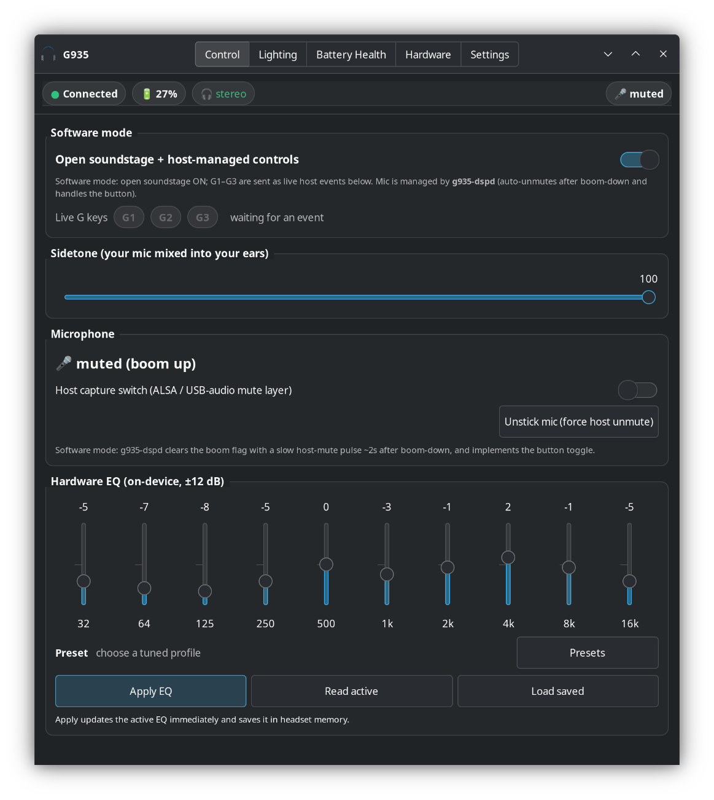
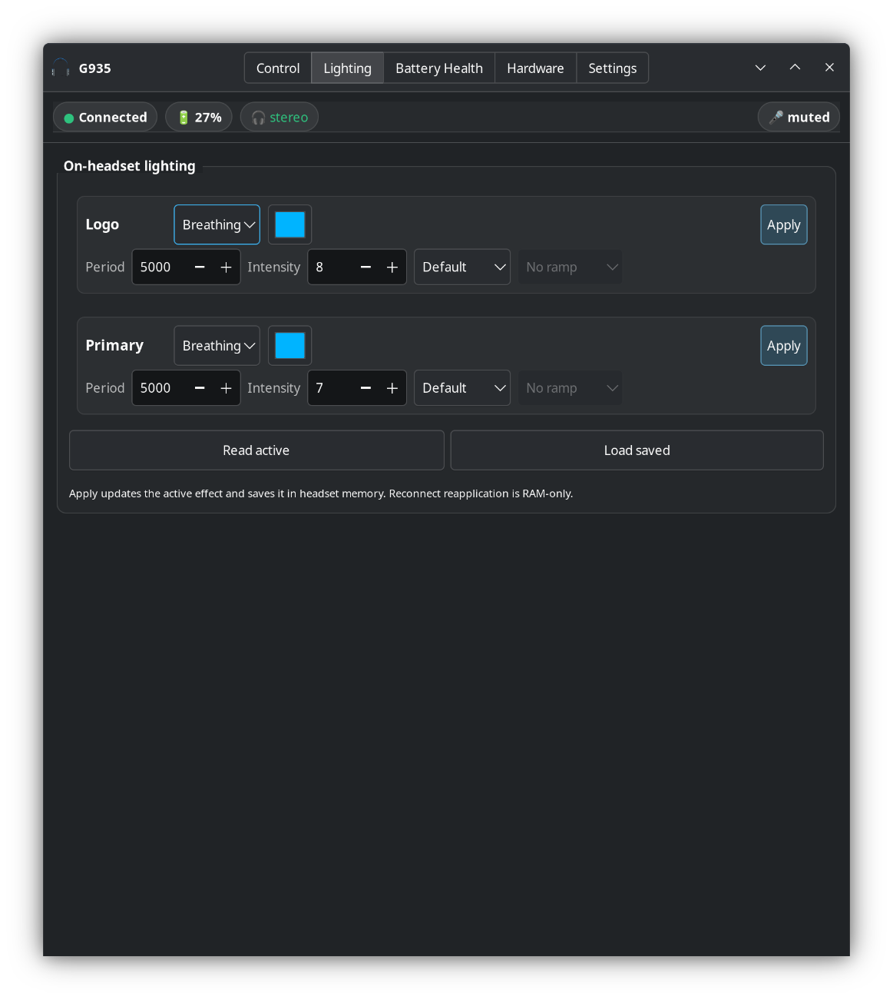
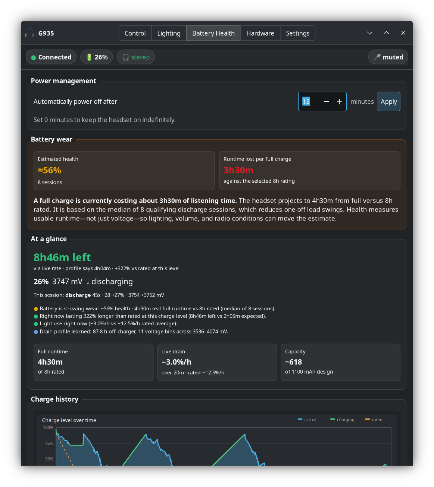
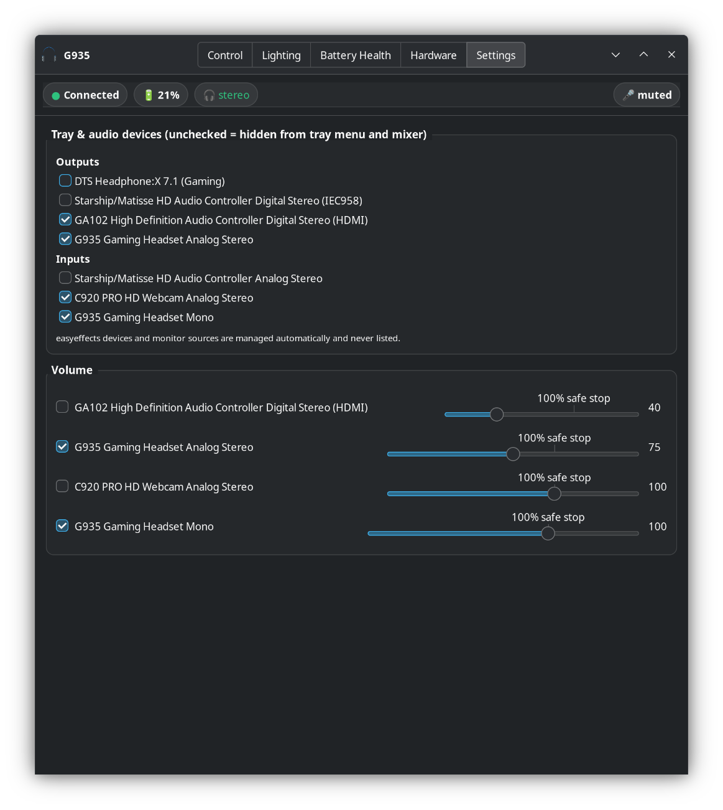
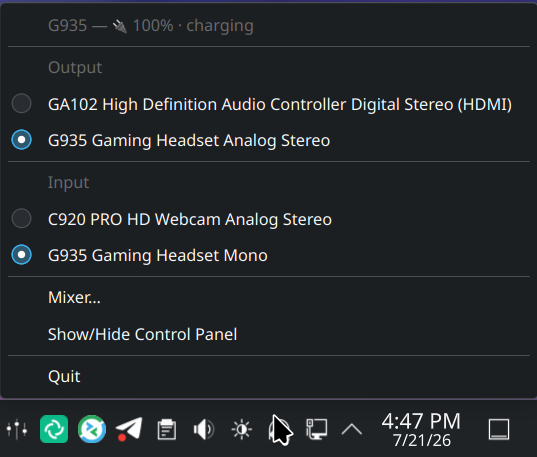

# g935-linux — full Logitech G935 control on Linux

A native GTK3 control panel and background service for the Logitech G935
wireless headset. It talks directly to the receiver over HID++—no G HUB,
Windows VM, or web account required.

[Latest release: v0.5](https://github.com/mattmattmatt1/g935-linux/releases/tag/v0.5)

## Major earcup-wheel upgrade

The physical volume wheel now feels like a real analog control instead of an
unpredictable media key. The receiver's press duration is decoded into smooth
1% changes: tiny movements stay precise, long sweeps accelerate progressively,
reversals are filtered, and wheel-up remains safely capped at 100%.

The tested balanced profile works out of the box. Six live comfort controls
let users tune fine adjustment, fine cadence, acceleration point, fast cadence,
maximum sweep distance, and reversal protection to taste. Calibration is no
longer required; raw capture and auto-fit remain available under collapsed
diagnostics for unusual hardware behavior.



## What it controls

- **Sound:** on-headset DSP soundstage, 10-band hardware EQ
  (32 Hz–16 kHz, ±12 dB), 18 categorized presets, and sidetone.
- **Microphone:** boom-up mute state, host mute recovery, mic-button handling,
  and daemon-backed auto-unmute in software mode.
- **Lighting:** independent controls for both RGB zones, including fixed,
  breathing, cycling, color, period, waveform, intensity, ramp, and boot
  animation where supported.
- **Battery:** live charge, voltage and runtime, learned drain history,
  estimated battery health, full-charge runtime loss, and auto power-off.
- **Desktop audio:** output/input visibility, default-device selection, tray
  mixer, and per-device volume. Sliders pause safely at 100%; release and drag
  again only when you deliberately need boost up to 150%.
- **Earcup wheel:** short receiver presses become fine changes, while the
  longer held signal produced by a fast sweep is decoded into a continuous
  series of real 1% changes. Each sweep has a configurable 50% ceiling,
  wheel-up stops at 100%, and sliders retain deliberate boost up to 150%.
  USB-mixer writes are rate-limited and an oscillation circuit breaker freezes
  abusive rapid reversals before they can flood the headset hardware.
  Settings expose fine adjustment, fine cadence, acceleration point, fast
  cadence, sweep limit, and reversal protection, with the tested profile as
  the balanced default. An optional collapsed capture/auto-fit tool measures
  press duration, shows the raw timeline, saves every event for debugging, and
  can fit those controls to an individual wheel.
- **Hardware:** live firmware and feature discovery, G1–G3 events, reconnect
  recovery, automatic left-channel-only detection/repair, and an advanced
  HID++ console tucked into a collapsed section.

The panel only exposes controls the connected headset reports as supported.
EQ and lighting changes can be saved in headset memory.

## Screenshots

| Control | Lighting |
|---|---|
|  |  |
| **Battery Health** | **Settings** |
|  |  |

<details>
<summary>Tray menu</summary>



</details>

## ⚠️ Tested on exactly one setup

This has only been tested on:

- **Logitech G935** (wireless receiver, USB PID `0a87`)
- **Kubuntu / Ubuntu 26.04 LTS**, KDE Plasma 6.6 on **Wayland**, PipeWire
- Python 3.14

Anything else — other headsets, other distros, GNOME, X11, PulseAudio — is
uncharted. The code tries to degrade gracefully (features it can't discover are
hidden, unknown devices prompt before probing), but you're in test-pilot
territory. **Issues or success reports: hit me up on X
[@MatthewPhone](https://x.com/MatthewPhone)** or open a GitHub issue.

## Prerequisites

```bash
sudo apt install python3-gi gir1.2-gtk-3.0 gir1.2-ayatanaappindicator3-0.1 \
                 alsa-utils pulseaudio-utils pipewire-bin libnotify-bin
```

- `python3-gi` + GTK3 — the control panel
- `gir1.2-ayatanaappindicator3-0.1` — tray icon (optional; without it the app
  runs windowed)
- `alsa-utils` (`amixer`) — boom-mic mute handling in software mode
- `pulseaudio-utils` (`pactl`) — audio device pickers/volume (works with
  PipeWire's PulseAudio-compatible server too)
- `pipewire-bin` (`pw-link`) — detects and repairs the left-ear-only route
  that can appear after suspend
- `libnotify-bin` (`notify-send`) — desktop warning when that route breaks
- `python3-hid` (or `pip install hid`) — only for the standalone
  `tools/g935-enable.py` hidapi path; the GUI and daemon don't need it

## Install or upgrade

### Fresh install

```bash
git clone https://github.com/mattmattmatt1/g935-linux.git
cd g935-linux

# Install the udev rule and mic-mute hwdb:
./install.sh --udev
# Unplug and reconnect the wireless receiver after this step.

# Install the panel, shared Python package, command, and user service:
./install.sh --user
# or: make install-user

# Launch:
g935-control
```

You can also run `python3 g935-control.py` directly from the checkout.

### Upgrade an existing checkout

```bash
git pull --ff-only
# Required once when upgrading from v0.4: installs wheel input permissions.
./install.sh --udev
# Unplug and reconnect the wireless receiver after the udev step.

./install.sh --user
systemctl --user try-restart g935-dsp
```

Quit and reopen the panel after upgrading. Re-running `--user` matters because
the application now installs the shared `g935/` package as well as the launch
scripts. After installing the v0.5 wheel rule once, the udev step does not need
to be repeated unless those rules change again.

### Background service

Enable the user service for software-mode mic handling and automatic DSP
restoration whenever the headset powers on:

```bash
systemctl --user enable --now g935-dsp
```

The panel works without the service in hardware mode.

## The interface

| Page | What is there |
|---|---|
| **Control** | software/hardware mode, live G keys, sidetone, microphone state, 10-band EQ, and a compact categorized Presets menu |
| **Lighting** | independent Logo and Primary/Strip RGB effects and saved settings |
| **Battery Health** | power management first, prominent wear and time-lost summary, live ETA/drain, history, learned profile, and session quality |
| **Hardware** | firmware, discovered HID++ features, stereo-route state/repair, and the collapsed advanced console |
| **Settings** | tray/mixer device visibility, adaptive earcup-wheel calibration, and 0–150% volume controls with a 100% safety stop |

Scroll-wheel input passes over sliders normally until you click a slider once,
preventing accidental EQ, sidetone, or volume changes while scrolling a page.

## The two modes

The headset has a mode switch (`11 ff 05 2b 01/00`) that changes more than sound.
**Default is hardware mode** (safe without the daemon). Flip the switch in the
GUI for software mode—the G HUB-style host-managed behavior.

| | **Hardware mode** (default) | **Software mode** |
|---|---|---|
| Sound | flat/narrow | DSP soundstage on |
| Boom mute | handled fully in firmware, just works | host must manage it (`g935-dspd`) |
| Mic button | works on-device | only emits an event (daemon handles it) |
| G1–G3 | headset defaults | diverted HID++ events shown live in the panel |

Mode is stored in `~/.config/g935/mode` and re-asserted by the daemon on every
power-on. **If you use software mode, run the daemon.** Without it, raising the
boom mutes the mic and nothing will unmute it (the panel warns you).

### Who owns what

| Job | Daemon running | Daemon not running |
|---|---|---|
| Power-on DSP enable | **daemon**, with panel reassertion after confirmed reconnects | control panel |
| Boom mute / button | **daemon** | panel shows state only (Unstick button) |
| EQ / lighting / sidetone | control panel | control panel |
| Mode toggle (user switch) | panel writes mode file + command | same |

## Battery health

The Battery Health tab logs voltage samples while the panel is open and builds:

- **Battery wear and runtime lost per full charge** in a high-visibility summary
- **Live remaining runtime** from recent discharge datapoints
- **Expected vs actual** comparison against the rated runtime spec
- **Learned drain profile** (mV/h by voltage bin) and session history graphs

Data lives in `~/.config/g935/health.json`. Health % needs longer off-charger
sessions (merged ≥30 min / ≥8% drop); short sessions still feed live ETA and
the profile. No coulomb counter exists — this is an honest voltage-based
extrapolation, not a BMS.

**While charging**, the headset ADC often reports the *charger path* (rail
spikes above 4.2 V), not resting cell voltage. The UI freezes SoC at the last
off-charger reading and shows path mV separately; full-charge peaks are taken
from rest after unplug, never from rail spikes.

### Left-ear-only after sleep

After suspend/resume, PipeWire/EasyEffects sometimes re-links only the left
channel into the G935 (`playback_FL`) and leaves the right port unconnected
(often named `playback_2`). The control panel checks every few seconds, shows
a **🎧 L-only** warning + banner, desktop-notifies, and auto-runs `pw-link` to
restore FR. Tray menu also gets **Fix stereo** while broken.

## Layout

| Path | Purpose |
|---|---|
| `g935-control.py` | GTK3 control panel |
| `g935-dspd.py` + `g935-dsp.service` | power-on watcher + software-mode mic daemon |
| `g935/` | shared library (HID++, mic, mode, battery, charts) |
| `99-g935.rules` | udev rule granting hidraw access |
| `70-g935-micmute.hwdb` | masks KEY_MICMUTE so the desktop stays out of software mode |
| `tools/` | research scripts (enable replay, sequence bisector) |
| `tests/` | offline unit tests (`make test`) |
| `install.sh` / `Makefile` | user + udev install |
| `easyeffects-g935.json` | optional EasyEffects preset (software EQ route) |

## Troubleshooting

| Symptom | Fix |
|---|---|
| Permission denied on hidraw | `./install.sh --udev`, then replug receiver |
| Tray icon missing (GNOME) | install AppIndicator extension, or run windowed |
| Mic stuck muted after boom up | enable daemon: `systemctl --user enable --now g935-dsp`, or switch to hardware mode |
| "press unmute twice" | install `70-g935-micmute.hwdb` via `./install.sh --udev` |
| Sound flat after power cycle | daemon not running, or mode is hardware — enable daemon / flip software mode |
| Only the left ear works after sleep | install `pipewire-bin`; the panel should detect and repair the missing right-channel link |
| Panel dead after unplug/replug | should auto-recover; if not, restart the panel (file a bug) |
| `g935-control: command not found` | ensure `~/.local/bin` is on `PATH`, or run `python3 g935-control.py` |

## Development

```bash
make test       # offline unit tests
make compile    # bytecode compile check
```

Research tools (fixed feature indices from 2026-07 captures; GUI discovers live):

```bash
python3 tools/g935-enable-v2.py   # full cold-connect with ACK/ERR
python3 tools/g935-step.py        # interactive sequence bisector
```

## License

[PolyForm Noncommercial 1.0.0](LICENSE) — free to use, modify, and share for
any noncommercial purpose. **Commercial use (including selling this or
products built on it) requires a separate license — contact
[@MatthewPhone](https://x.com/MatthewPhone) on X.**

## Credits / prior art

- [g933-utils](https://github.com/ashkitten/g933-utils) — HID++ groundwork on
  the sibling G933
- [HeadsetControl](https://github.com/Sapd/HeadsetControl) — sidetone/battery
  for many headsets, including this one
